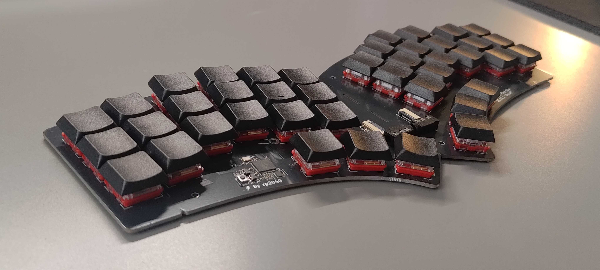
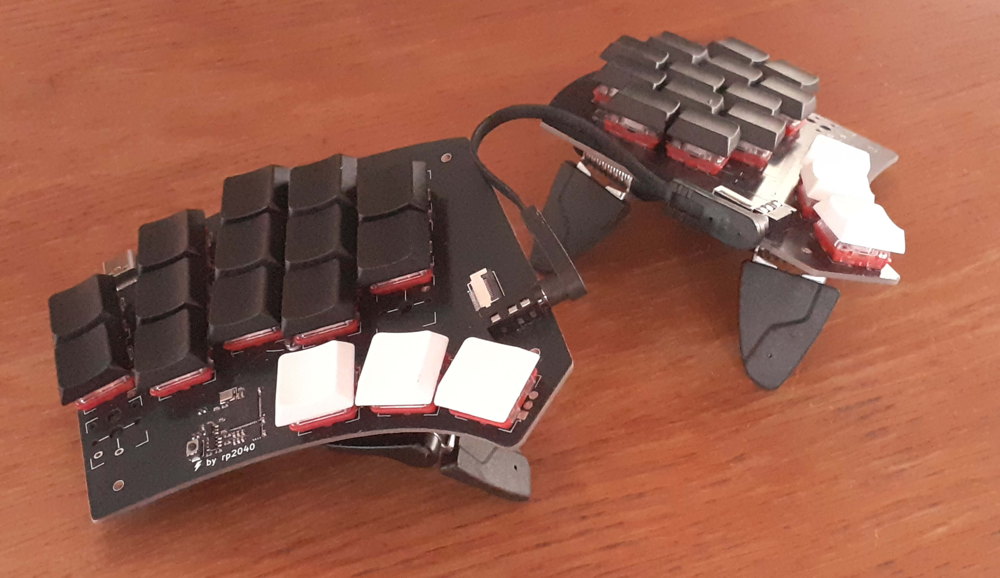

# Quacken

Libre, ergonomic, *polymorphic*: a single PCB for many possible layouts.

[3×6, 3×5, hummingbird, and everything in between](https://onedeadkey.github.io/quacken/).

[More pics…](pics#readme)

## Project

This keyboard is mostly [Nuclear-Squid]’s work:

- [hardware] design (KiCad and Ergogen sources)
- [ZMK firmware] implementing the [Selenium] keymap

If you want to build or submit a case for this keeb, here’s the FreeCAD source:

- [quacken_flex.FCStd](quacken_flex.FCStd)

[Selenium]:      https://onedeadkey.github.io/selenium
[hardware]:      https://github.com/Nuclear-Squid/quacken
[ZMK firmware]:  https://github.com/Nuclear-Squid/zmk-keyboard-quacken
[Nuclear-Squid]: https://github.com/Nuclear-Squid

## Roadmap

- [x] onboard RP2040 (left) and I/O expander (right)
- [x] splittable in two (I²C communication over a TRRS cable)
- [x] splittable outer columns
- [ ] hotswap sockets
- [ ] optional Circle Trackpad
- [x] optional rotary encoders
